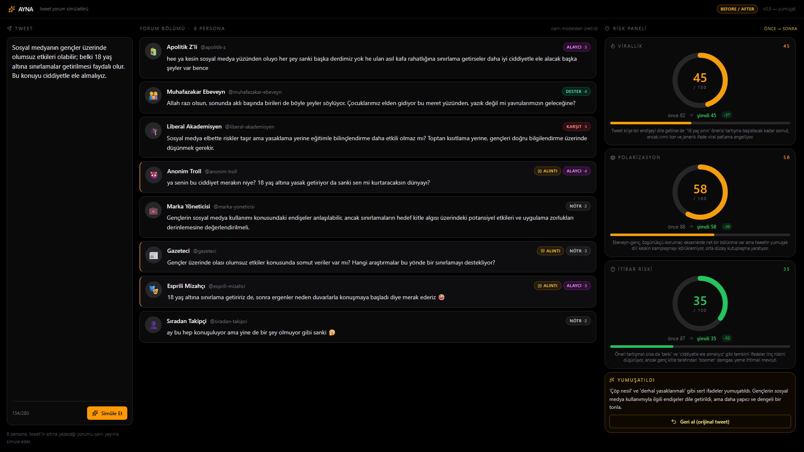

# Mirror — Tweet Simülatörü

Bir tweet'i **paylaşmadan önce** Türkçe sosyal medyada yaratacağı yorum bölümünü ve risk skorunu simüle eden web uygulaması. 8 yapay persona tweet'e doğal Türkçe tepkiler yazar, 3-modelli bir LLM Council bağımsız puanlama yapıp sentezler, riskli ise tweet'i **niyetini koruyarak** yumuşatır (Tree-of-Thoughts ile 3 alternatif değerlendirilir, en güvenlisi seçilir).

> Medipol Hackathon projesi. Önce **AYNA** adıyla geliştirildi, sonra **Mirror** olarak markalandı.



---

## Ne yapar?

- **Composer (sol):** Kullanıcı tweet'ini yazar. Hazır demo seed'lerinden biriyle (örn. Ruhi Çenet'in gerçek bir tweet'i) tek tıkla profil + metin yüklenebilir.
- **8 persona yorumu (orta):** SSE ile canlı akış — her persona için _stance_ (destek/karşıt/alaycı/nötr), _intensity_, _replyType_ (reply/quote) ve X-stili etkileşim sayıları.
- **Risk Paneli (sağ):**
  - **Uzman Kurulu** — 3 model (Claude / GPT-4o / Gemini) bağımsız puan verir, başkan model sentezler.
  - **3 metrik:** Virallik, Polarizasyon, İtibar Riski (0-100, renk zonlu) + her birinin altında council gerekçesi.
- **Yumuşat (Tree-of-Thoughts):** Orchestrator 3 dal (ölçülü / soru formuna çevir / kişiselden genele) üretir, ucuz bir değerlendirici en iyisini seçer. Sonra otomatik tekrar simüle → **önce/sonra** delta rozetleriyle risk düşüşü görselleştirilir.
- **Demo modu (`AYNA_DEMO_MODE=1`):** Tüm yanıtlar sabit `server/demoCache.js`'ten gelir — video çekimi için %100 deterministik, sıfır API riski.

---

## Teknoloji

- **Frontend:** Vite + React (JavaScript, TypeScript yok) + Tailwind v4 + shadcn-stili primitifler + framer-motion + lucide-react + Inter font
- **Backend:** Node + Express + SSE streaming
- **LLM:** OpenRouter — modeller `src/config.js` `MODEL_ROLES` üzerinden tek noktadan yönetilir

---

## Gereksinimler

- **Node.js ≥ 20.6** (built-in `fetch` + `--env-file` desteği için)
- **npm** (Node ile gelir)
- **OpenRouter API key** — https://openrouter.ai/keys adresinden alabilirsin (canlı mod için gerekli; demo modu için gerekmez)

---

## Kurulum

```bash
git clone https://github.com/sametakin44/medipol-hackathon.git
cd medipol-hackathon
npm install
```

### `.env` dosyasını oluştur

```bash
cp .env.example .env
```

`.env` içine OpenRouter API key'ini ekle:

```ini
OPENROUTER_API_KEY=sk-or-v1-...
OPENROUTER_APP_NAME=Mirror
OPENROUTER_APP_URL=http://localhost:5173
PORT=3001
```

> **Windows** kullanıcıları: `cp` yerine `copy .env.example .env` kullan.

---

## Çalıştırma

İki ayrı terminal aç.

### Terminal 1 — Backend (Express)

```bash
node server/index.js
```

> Çıktıda `http://localhost:3001` + `OPENROUTER_API_KEY: OK` görmelisin. Port çakışmasında server hata mesajı verip çıkar.

### Terminal 2 — Frontend (Vite dev)

```bash
npm run dev
```

Tarayıcıda **http://localhost:5173** aç. Frontend `/api/*` isteklerini otomatik olarak `:3001`'e proxy'ler.

---

## Demo modu (canlı API olmadan)

Video çekimi veya jüri sunumu için: backend'i demo modunda başlat. Cache'lenmiş sabit cevaplar SSE üzerinden **gerçekçi gecikmelerle** akıtılır.

```bash
# Linux / macOS
AYNA_DEMO_MODE=1 node server/index.js

# Windows PowerShell
$env:AYNA_DEMO_MODE="1"; node server/index.js
```

Çıktıda `DEMO_MODE: AÇIK (cache replay)` görmelisin. Demo seed butonuna tıkla → "Simüle Et" → sonuçlar anında gelir, Yumuşat akışı da cache'ten.

> **Yeni demo cache üretmek için** (DEMO_TWEET'i değiştirdiysen veya yeni bir tweet için cache hazırlamak istersen): canlı modda server'ı başlat, sonra `node scripts/generate-demo-cache.js --tweet="..."`.

---

## Proje yapısı

```
medipol-hackathon/
├── .env.example                    OpenRouter key şablonu
├── server/
│   ├── index.js                    Express + /api/simulate (SSE) + /api/soften
│   ├── personas.js                 8 detaylı Türkçe persona prompt'u
│   ├── council.js                  3 aşamalı LLM Council (paralel skor + çapraz kritik + başkan sentezi)
│   ├── soften.js                   Tree-of-Thoughts Yumuşat (3 dal + değerlendirici)
│   ├── demoCache.js                Demo modu için sabit cevaplar (otomatik üretilir)
│   ├── cache.js                    60sn TTL council cache
│   ├── openrouter.js               OpenRouter çağrı yardımcısı + JSON parse fallback
│   ├── riskScore.js                Heuristic fallback (council çökerse)
│   └── loadEnv.js                  Hafif .env yükleyici
├── scripts/
│   ├── generate-demo-cache.js      Canlı API → demoCache.js
│   ├── test-step5.js               Entegrasyon test (cache + soften + delta)
│   ├── test-council-fallback.js    Council üye-hata senaryoları
│   ├── test-json-fallback.js       JSON parser unit testi
│   ├── screenshot-1080p.js         Playwright 1080p ekran görüntüsü
│   └── turkce-test.js              Model × prompt Türkçe doğallık matrisi
└── src/
    ├── App.jsx                     3 sütun ana ekran, SSE okuyucu, Yumuşat akışı
    ├── config.js                   MODEL_ROLES (tek model adı kaynağı) + PERSONAS
    ├── seeds.js                    Hazır demo seed'leri (Ruhi Çenet vb.)
    ├── mockData.js                 Backend çökerse fallback
    ├── lib/
    │   ├── sse.js                  POST tabanlı SSE okuyucu
    │   ├── engagement.js           Persona payload'tan X etkileşim sayıları
    │   └── utils.js                cn() helper
    └── components/
        ├── CouncilPanel.jsx        3 council model rozeti
        ├── StanceBar.jsx           Stance dağılım çubuğu
        ├── PersonaCard.jsx         X-stili persona yorum kartı
        ├── RiskGauge.jsx           Dairesel risk göstergesi + before/after delta
        └── ui/                     shadcn-stili button / card / textarea / skeleton
```

---

## Konfigürasyon (`src/config.js`)

Tüm OpenRouter model adları **tek noktadan** yönetilir:

| Rol | Model | Kullanım |
|---|---|---|
| `personaPrimary` | `google/gemini-2.5-flash` | 6 persona — hızlı/ucuz |
| `personaSharp` | `openai/gpt-4o` | troll + akademisyen + mizahçı (ince argo/ironi kritik) |
| `councilA` (başkan) | `anthropic/claude-sonnet-4.5` | Council sentezi |
| `councilB` | `openai/gpt-4o` | Council 2. üye |
| `councilC` | `google/gemini-2.5-flash` | Council 3. üye |
| `orchestrator` | `openai/gpt-4o` | Yumuşat dal üreticisi |
| `softenEvaluator` | `google/gemini-2.5-flash` | ToT değerlendirici (ucuz) |

---

## Yararlı komutlar

```bash
npm run build                       Üretim build (dist/)
npm run dev                         Vite dev server
npm run lint                        ESLint

node server/index.js                Backend (canlı)
AYNA_DEMO_MODE=1 node server/index.js   Backend (demo modu)

node scripts/test-step5.js          E2E test (cache + soften + delta)
node scripts/test-council-fallback.js   Council üye-hata senaryoları
node scripts/test-json-fallback.js  JSON parse fallback unit testi
node scripts/turkce-test.js         Model × prompt Türkçe doğallık matrisi
node scripts/generate-demo-cache.js Demo cache yeniden üret
```

---

## Bilinen sınırlar

- **Reply zinciri yok.** Personalar şu an birbirlerine yanıt vermiyor; her biri tweet'e bağımsız tepki verir. Sonraki adım olarak planlandı.
- **Mobil layout** masaüstü-öncelikli; <768px ekranda 3 sütun tek sütuna düşer.
- **Council ~7 LLM çağrısı** — canlı modda toplam ~20 sn. 60sn TTL cache ile aynı tweet tekrar simüle edilince anında döner.
- **Türkçe persona doğallığı** için modeller seçildi; İngilizce tweet'lerle test edilmedi.

---

## Lisans

Hackathon projesi — eğitim/demo amaçlı. OpenRouter ve modellerin kendi lisansları geçerlidir. X (Twitter) markası veya logoları **kullanılmadı** — sadece estetik olarak X koyu mod hissi alındı; doğrulama tiki için lucide-react'in jenerik `BadgeCheck` ikonu kullanıldı.

---

## Sorun mu var?

- `OPENROUTER_API_KEY tanımlı değil` → `.env` dosyasını oluşturup key'i ekle, sonra server'ı yeniden başlat.
- `Port 3001 dolu` → Eski node sürecini kapat: `netstat -ano | findstr :3001` ile PID bul, `taskkill /F /PID <pid>` (Windows).
- **Demo mode'da Yumuşat akışı çalışmıyor** → DEMO_TWEET'i değiştirdiysen `node scripts/generate-demo-cache.js` ile cache'i yeniden üret.

---

**Çalışan demo:** `AYNA_DEMO_MODE=1 node server/index.js` → http://localhost:5173 → "Ruhi Çenet — taklit ithamı" chip'ine tıkla → "Simüle Et" → "Yumuşat ve tekrar dene".
