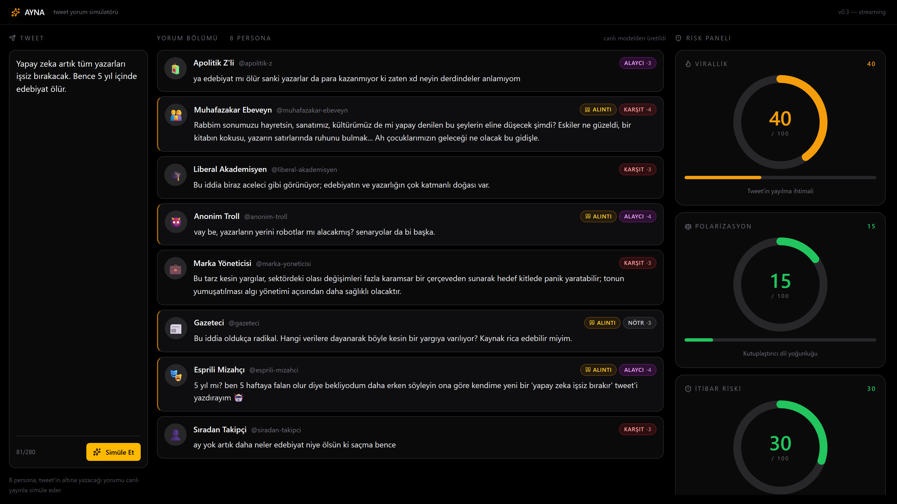

# AYNA — Adım 3 Raporu

**Kapsam:**
- Parça A: Persona çıktısı düz metinden **yapılandırılmış JSON**'a geçti (`comment`, `stance`, `intensity`, `willEngage`, `replyType`). Persona başına model rolü (`personaPrimary` / `personaSharp`). "Tweet'e özgüllük" kuralı tüm promptlara eklendi.
- Parça B: `POST /api/simulate` artık **SSE** (Server-Sent Events) yayını yapıyor; her persona yanıtı hazır olduğunda ANINDA bir event olarak frontend'e iniyor. UI bu adım için yeniden tasarlandı: 2/7/3 sütun oranı, büyük dairesel risk göstergeleri, stance rozetleri, quote tarzı kart, "yazıyor…" placeholder, akıştaki canlı sayaç.

**Kapsam DIŞI (Adım 4+'a bırakıldı):** LLM Council, "Yumuşat" butonu, council tabanlı gerçek risk skorlaması.

---

## 0. Bonus — Önceden açılan bug: `'process' is not defined`

`scripts/turkce-test.js` ve `server/**` Node ortamında çalışıyor ama `eslint.config.js` tüm dosyalara `globals.browser`'ı uyguluyordu. Çözüm: ESLint config'i ikiye böldüm:
- `src/**` → browser globals + React kuralları.
- `server/**`, `scripts/**`, `vite.config.js` → `globals.node + globals.nodeBuiltin`.

`npx eslint scripts/turkce-test.js server/` artık sessiz.

---

## 1. Değişen Dosya Yapısı

`✦ DEĞİŞTİ` mevcut dosyada güncelleme, `✦ YENİ` yeni dosya:

```
ayna/
├── .gitignore                       (değişmedi)
├── package.json                ✦ DEĞİŞTİ — playwright -D, test:turkce/server scripts'i mevcut
├── eslint.config.js            ✦ DEĞİŞTİ — node globals scripts/ + server/
├── vite.config.js                   (değişmedi — proxy hâlâ aktif)
├── scripts/
│   ├── turkce-test.js               (Adım 2)
│   ├── test-json-fallback.js   ✦ YENİ  — persona JSON parse fallback unit testi
│   └── screenshot.js           ✦ YENİ  — Playwright headless money-shot
├── server/
│   ├── index.js                ✦ DEĞİŞTİ — SSE streaming, EADDRINUSE handler, res.on(close)
│   ├── openrouter.js           ✦ DEĞİŞTİ — JSON parse + per-persona model + onPersona callback
│   ├── personas.js             ✦ DEĞİŞTİ — JSON çıktı kuralı + SPESİFİK kural + stance notu
│   ├── riskScore.js                 (Adım 2)
│   └── loadEnv.js                   (AYNA_SKIP_DOTENV koruması; mevcut)
├── docs/screenshots/
│   └── step3-money-shot.png    ✦ YENİ  — bu raporda kullanılan ekran görüntüsü
└── src/
    ├── App.jsx                 ✦ DEĞİŞTİ — SSE okuyucu, 2/7/3 layout, streaming state
    ├── config.js               ✦ DEĞİŞTİ — her personaya modelRole alanı
    ├── lib/sse.js              ✦ YENİ   — POST + SSE okuyucu (EventSource POST'u desteklemiyor)
    ├── components/
    │   ├── PersonaCard.jsx     ✦ DEĞİŞTİ — stance rozeti, quote stili, PersonaPending placeholder
    │   └── RiskGauge.jsx       ✦ DEĞİŞTİ — büyütüldü (168px), eşik renkleri (0-39 yeşil, 40-69 amber, 70+ kırmızı)
    └── mockData.js                  (silinmedi — backend hatasında fallback)
```

---

## 2. Persona JSON Formatı

Her persona artık `comment + meta` döndürür. Sistem promptu içine **zorunlu çıktı şeması** ve **SPESİFİK kural** ekli; ayrıca her personanın **stance notu** (tipik duruşu) belirtili.

### Şema

```json
{
  "comment": "yorum metni (1-2 cümle, doğal Türkçe)",
  "stance": "destek" | "karsit" | "notr" | "alayci",
  "intensity": 1-5,
  "willEngage": true | false,
  "replyType": "reply" | "quote"
}
```

### Eklenen "SPESİFİK" kuralı (tüm 8 promptun gövdesinde)

```
TWEET'E ÖZGÜLLÜK KURALI (KRİTİK):
- Tweet'in SPESİFİK iddiasına, kullandığı kelimelere, somut konusuna tepki ver.
- Persona klişeni her tweet'e körü körüne kopyalama. Karakterin sabit kalır AMA söylediğin
  şey tamamen o tweet'e özel olmalı.
- Tweet farklıysa yorumun da TAMAMEN farklı olmalı. Hazır kalıp yapıştırma.
- Tweet'i özetleme veya tekrar etme; ona yanıt ver.
```

### Per-persona model atamaları (`src/config.js`)

| Persona | modelRole | Slug |
|---|---|---|
| apolitik-z | personaPrimary | google/gemini-2.5-flash |
| muhafazakar-ebeveyn | personaPrimary | google/gemini-2.5-flash |
| **liberal-akademisyen** | **personaSharp** | **openai/gpt-4o** |
| **anonim-troll** | **personaSharp** | **openai/gpt-4o** |
| marka-yoneticisi | personaPrimary | google/gemini-2.5-flash |
| gazeteci | personaPrimary | google/gemini-2.5-flash |
| esprili-mizahci | personaPrimary | google/gemini-2.5-flash |
| siradan-takipci | personaPrimary | google/gemini-2.5-flash |

> Troll ve liberal-akademisyen Sharp'ta çünkü ince argo ve kavramsal eleştiri tonu, hızlı modelde sığlaşabiliyor.

### Örnek canlı çıktı (Tweet: "Yapay zeka tüm yazarları işsiz bırakacak.")

```json
{ "personaId": "apolitik-z",
  "comment": "ya edebiyat ne ölür ya sanki yazarlar da para kazanmıyor ki zaten xd",
  "stance": "alayci", "intensity": 3, "willEngage": false, "replyType": "reply",
  "model": "google/gemini-2.5-flash", "roleKey": "personaPrimary" }

{ "personaId": "anonim-troll",
  "comment": "vay be, yazarlık yerini robotlar mı alacakmış? Senaryolar da bi başka.",
  "stance": "alayci", "intensity": 4, "willEngage": true, "replyType": "quote",
  "model": "openai/gpt-4o", "roleKey": "personaSharp" }

{ "personaId": "gazeteci",
  "comment": "Bu iddia oldukça radikal. Hangi verilere dayanarak böyle kesin bir yargıya varıyorsunuz? Kaynak rica edebilir miyim.",
  "stance": "notr", "intensity": 3, "willEngage": true, "replyType": "quote",
  "model": "google/gemini-2.5-flash", "roleKey": "personaPrimary" }
```

---

## 3. SSE Akışı

### Sunucu tarafı (`server/index.js`)

`POST /api/simulate` artık `text/event-stream` döndürür. Yayın sırası:

1. **`meta`** — beklenen 8 personaId, primary/sharp model adları, startedAt.
2. **`persona`** — her LLM çağrısı tamamlandığında ANINDA (8 olay, sırasız). Payload: `{personaId, comment, stance, intensity, willEngage, replyType, model, roleKey, error?}`.
3. **`risk`** — 8 persona bittikten sonra: `{virallik, polarizasyon, itibarRiski}`.
4. **`done`** — `{elapsedMs, total}`.
5. **`error`** — herhangi bir aşamada (API key yok, beklenmedik hata): `{code, message, hint?}`.

Yan detaylar:
- 15 sn'de bir `: ping\n\n` keep-alive yorum satırı (bazı proxy'ler aksi halde idle bağlantıyı kapatır).
- Client gerçekten kopunca (`res.on("close")` + `res.writableEnded === false`) kalan çağrılar yine tamamlanır ama yazılmaz.
- **Sürpriz bug ve çözümü:** Node 24 + Express 5'te `req.on("close")` body tüketildiğinde de fire ediyor — meta event yazıldıktan hemen sonra `clientGone=true` olup tüm persona olayları yutuluyordu. Çözüm: dinleyici `res.on("close")` (gerçek socket destroy) yapıldı. Server-side trace logları (`[openrouter] -> / <-`, `[simulate] -> persona event ...`) çözümü görünür kılmak için duruyor.

### Frontend SSE okuyucu (`src/lib/sse.js`)

`EventSource` yalnızca GET destekliyor; POST gövdesiyle tweet göndermemiz lazım. Bu yüzden `fetch(...).body.getReader()` üstüne kendi SSE parser'ımızı yazdık (`\n\n` ayırıcısı + `event:`/`data:` satır ayrıştırması). Handler haritası: `{ meta, persona, risk, done, error, onTransportError }`.

### Diagnostic koşu

```
status 200
+118ms  event: meta
+2540ms event: persona  (siradan-takipci)
+2649ms event: persona  (apolitik-z)
+2649ms event: persona  (gazeteci)
+2758ms event: persona  (liberal-akademisyen, openai/gpt-4o)
+2881ms event: persona  (muhafazakar-ebeveyn)
+3185ms event: persona  (marka-yoneticisi)
+3675ms event: persona  (anonim-troll, openai/gpt-4o)
+5794ms event: persona  (esprili-mizahci)
+5795ms event: risk
+5795ms event: done   → elapsedMs=5716
```

İlk persona ~2.5 sn'de geliyor; UI bu sırada `PersonaPending`'leri göstermiş, sonra teker teker dolmuş oluyor.

---

## 4. Yeni UI Layout

| Bölüm | Sütun (12'lik grid) | İçerik |
|---|---|---|
| Header | tam genişlik (44px) | Logo + "v0.3 — streaming"; akış sırasında "X/8 canlı akış" rozeti |
| Sol — Tweet | `md:col-span-2` (dar) | Textarea, char counter, Simüle Et / Durdur |
| Orta — Yorum Bölümü | `md:col-span-7` (yıldız, en geniş) | 8 persona kartı; her biri SSE olayıyla framer-motion `initial→animate` ile yer açar; henüz gelmeyenler için `PersonaPending` ("yazıyor…" + spinner + animasyonlu noktalar) |
| Sağ — Risk Paneli | `md:col-span-3` (orta) | 3 büyük (168px) dairesel gauge; 0→değer animasyonlu; eşik renkleri (yeşil <40, amber 40-69, kırmızı ≥70) |

### Kart durumları (orta sütun)

- **Boş durum** (henüz Simüle Et basılmadı) — kesik kenarlıklı placeholder + amber kıvılcım ikonu.
- **Streaming** — gelmeyenler "yazıyor…" placeholder; gelen her kart framer-motion ile yumuşak alttan giriş.
- **Done** — her kartta stance rozeti (renkli, yoğunluk noktasıyla), `replyType="quote"` ise kart soluna ince amber kenarlık + sağda küçük "alıntı" rozeti.

### Stance rozeti renkleri

| stance | renk |
|---|---|
| destek | emerald (yeşil) |
| karşıt | red |
| alaycı | fuchsia (mor) |
| nötr | zinc (gri) |

### Risk Paneli görünümü

Üst satır: ikon + label + sayısal değer (renkli).
Orta: büyük dairesel gauge; merkez 4XL font + "/ 100".
Alt: ince yatay bar + hint metni ("Tweet'in yayılma ihtimali" vb.).

---

## 5. Ekran Görüntüsü (Money Shot)



> 1600×900 viewport, deviceScaleFactor 2 (yani gerçek 3200×1800 retina-kalite). Playwright headless chromium ile alındı: `node scripts/screenshot.js`.

Görselde tek bakışta görünenler:
- 8 farklı persona kartı, hepsi aynı tweet'e ("Yapay zeka tüm yazarları işsiz bırakacak…") özgün Türkçe yorum üretmiş.
- Stance rozetleri farklı: troll/mizahçı "alaycı", marka yöneticisi "karşıt", gazeteci/akademisyen "nötr", sıradan takipçi "karşıt".
- Risk paneli sağda büyük ve seçik: Virallik 40 (amber), Polarizasyon 15 (yeşil), İtibar Riski 30 (yeşil).
- Layout dengesizliği Adım 2'deki kadar belirgin değil; orta sütun yıldız.

---

## 6. Build + Sunucu + Test Sonuçları

| Kontrol | Sonuç |
|---|---|
| `npm run build` | ✅ 528 ms, hata yok (`dist/index.js` 371.47 kB / gzip 118.83 kB) |
| Express SSE sunucusu | ✅ `http://localhost:3001` (direct `node server/index.js` — TaskStop temiz kapatıyor) |
| Vite dev sunucusu | ✅ `http://localhost:5173` (auto-restart proxy değişimlerinde) |
| `/api/health` | ✅ `{"ok":true,"apiKeyConfigured":true,"personaCount":8}` |
| SSE end-to-end (örnek tweet) | ✅ 5.8 sn'de 8 persona + risk + done |
| API key olmadan SSE | ✅ `meta` → `error{code:"MISSING_API_KEY", message:"…", hint:"…"}` |
| `scripts/test-json-fallback.js` | ✅ 7/7 case (düz JSON, markdown fence, prefix/suffix metin, bozuk metin, eksik alan, geçersiz stance, eksik kapanış) |
| Mock fallback UI'da | ✅ backend down/error olunca üst kırmızı banner + `MOCK_COMMENTS` doluyor |
| Frontend SSE okuyucu | ✅ stance rozetleri renkli, "alıntı" kartları amber-bordered, "yazıyor…" placeholder akış sırasında |
| `npx eslint scripts/ server/` | ✅ uyarısız (process tanımlı) |

### API key olmadan davranış (SSE)

Geçici olarak `.env` `mv` ile bir kenara alındı, sunucu `AYNA_SKIP_DOTENV=1 PORT=3099` ile başlatıldı:

```
event: meta
data: {"expectedPersonaIds":[...], "model":"google/gemini-2.5-flash", "sharpModel":"openai/gpt-4o", ...}

event: error
data: {"code":"MISSING_API_KEY",
       "message":"OPENROUTER_API_KEY tanımlı değil. .env dosyasını oluşturup anahtarı doldurun.",
       "hint":".env.example dosyasını .env olarak kopyalayıp OPENROUTER_API_KEY değerini doldurun, sonra sunucuyu yeniden başlatın."}
```

Frontend bu `error` event'ini görünce `errorMsg` set ediyor, üst banner kırmızı tonla geliyor, `MOCK_COMMENTS` + `MOCK_RISK` ile UI'ı dolduruyor; pre-streaming durum spinner'ı bekleyişte takılı kalmıyor. `.env` test sonrası geri alındı.

### Bozuk JSON parse fallback

`scripts/test-json-fallback.js`, `openrouter.js`'in iç parser'ını (`parsePersonaJson`) doğrudan exercise eder. 7 senaryoyu çalıştırır:

```
  Düz JSON ... OK
  Markdown fenced JSON ... OK
  JSON öncesi/sonrası metin ... OK
  Tamamen bozuk metin ... OK (beklenen hata: JSON bloğu bulunamadı.)
  JSON ama eksik alan ... OK
  JSON ama geçersiz stance ... OK
  Bozuk JSON (eksik kapanış) ... OK (beklenen hata: JSON bloğu bulunamadı.)
Toplam: 7 ok, 0 fail
```

Parse hatası kullanıcı arayüzünde: o personaya ait kart yine geliyor ama `comment` alanında "`(bu persona şu an cevap veremedi: <reason>)`", `stance=notr`, `intensity=1` — tek bir kart "sessize" düşse bile feed bütünüyle gelir.

---

## 7. Karşılaşılan Sorunlar ve Çözümleri

| Sorun | Tespit | Çözüm |
|---|---|---|
| `'process' is not defined` ESLint hatası | IDE turkce-test.js'te flag attı | ESLint config'i ikiye böldüm: `src/**` browser, `server/** + scripts/**` node globals. |
| Express 5 / Node 24 — `req.on("close")` meta event sonrası anında fire ediyordu | Server log'unda her persona için "clientGone, skipping" gördüm, oysa client hâlâ açıktı | Dinleyici `res.on("close")` yapıldı (gerçek socket destroy); `writableEnded` true ise no-op. |
| `npm run server` Windows'ta orphan node bırakıyordu | TaskStop sadece npm wrapper'ı kapatıyor, alttaki node 3001'i tutuyordu | Background task'ı `node server/index.js` ile başlatıyoruz (kullanıcı talebi); TaskStop artık temiz. Ayrıca server EADDRINUSE'u yakalayıp anlamlı mesajla çıkıyor. |
| `response_format: { type: "json_object" }` bazı modellerde belirsiz davranış | İlk denemede tüm 8 çağrı çok yavaş ya da hiç dönmüyor olabilir endişesi | `AYNA_FORCE_JSON_FORMAT=1` env'iyle opt-in yaptım; default'ta promptun "SADECE JSON döndür" kuralına güveniyoruz. Parser zaten markdown fence + prefix/suffix metni temizliyor. |
| EventSource POST'u desteklemiyor | Frontend GET vs POST tartışması | `fetch + ReadableStream` üstüne 80 satırlık kendi SSE parser'ımızı yazdım (`src/lib/sse.js`); EventSource'tan daha esnek (handler haritası + transport-error). |
| Playwright chromium indirme süresi | İlk seferde uzun sürer | npm script eklemedim; `npx playwright install chromium` bir kez çalıştı, lokalde `ms-playwright/chromium-1223` cache'lendi. Sonraki shot saniyeler içinde alınıyor. |

---

## 8. Adım 4 İçin Açık Noktalar / Varsayımlar

- **Council & gerçek risk.** Şu an `server/riskScore.js` heuristik bir mock üretiyor (kelime sayımı + uzunluk). Adım 4'te 3 council modeli (config: `councilA/B/C`) 8 persona yorumunu girdi alıp gerçek skoru üretecek; SSE event sözleşmesi değişmiyor — sadece kaynak `computeRiskScores` yerine LLM olacak.
- **Stance dağılımı analitiği.** UI'da şu an her kart kendi stance rozetini gösteriyor. Adım 4'te risk panelinin üstünde küçük bir "destek 2 / karşıt 3 / alaycı 2 / nötr 1" dağılım çubuğu eklenebilir.
- **Persona model değişimi.** Sharp'a `gpt-4o` veriyoruz, ama OpenRouter'da bu model bazen yavaş. `MODEL_ROLES.personaSharp`'ı değiştirmek isteyen geliştirici tek yerden yapabilir; troll/akademisyen otomatik aktarılır.
- **Streaming iptal.** `Durdur` butonu `AbortController.abort()` çağırıyor; sunucu tarafında bu, gerçek client disconnect üretmeli ve `res.on("close")` clientGone'u tetiklemeli. Doğrulamak için tarayıcıda 1 saniye sonra durdurma testi yapılmalı.
- **Mobil layout.** `md:col-span-2/7/3` mobilde `col-span-12` ile tek sütuna düşüyor. Adım 4'te mobil etkileşim haritası planlanabilir (ör. ekran altı tab bar ya da Council/Risk için ayrı sayfa).
- **JSON çıktısının doğal Türkçeden ödün vermemesi.** İlk gözlemlerde sorun yok (Gemini ve gpt-4o JSON formatına uyum sağlarken ton kayıyor değil). Adım 4'te council kalitesini ölçerken aynı zamanda persona doğallığı da skorlanabilir (Türkçe doğallık testinin bir tur ileri formu).

---

## 9. Çalışan Sunucular

- **Backend (SSE):** [http://localhost:3001](http://localhost:3001) — `GET /api/health`, `POST /api/simulate` (text/event-stream)
- **Frontend (Vite + /api proxy):** [http://localhost:5173](http://localhost:5173)
- **Ekran görüntüsü:** [`docs/screenshots/step3-money-shot.png`](docs/screenshots/step3-money-shot.png)
