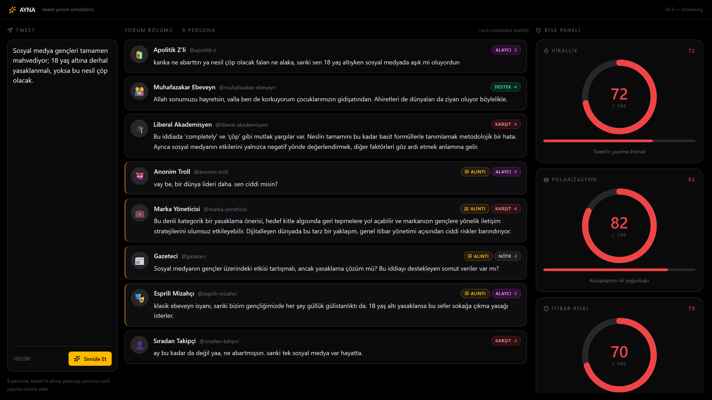

# AYNA — Adım 4 Raporu

**Kapsam:**
- **Parça A** — Persona keskinleştirme: anonim-troll yazarı doğrudan hedef alıyor, liberal-akademisyen artık spesifik mantık hatası işaret ediyor + ironi serbest. Tüm personalardan "kibar olmak için" yumuşatma vurguları çıktı; doğal sertlik (küfür/hakaret/tehdit hariç) serbest. `replyType="quote"` yalnızca 3 personayla sınırlandı: troll, gazeteci, esprili-mizahçı.
- **Parça B** — Gerçek **LLM Council** risk skoru: 3 aşamalı mimari (`server/council.js`), 3 üye paralel skor → çapraz kritik → başkan sentezi. SSE `risk` event'i artık council'den geliyor + `gerekce` (her metrik için 1 cümle) içeriyor. 3 üye de hata verirse heuristic mock'a düşülüyor.

**Kapsam DIŞI (Adım 5):** "Yumuşat" butonu.

---

## 1. Değişen Dosya Yapısı

```
ayna/
├── server/
│   ├── personas.js              ✦ DEĞİŞTİ — keskinleştirildi, HARD_LIMITS bloğu eklendi, quote'u 3 personaya indirildi
│   ├── council.js               ✦ YENİ   — 3 aşamalı LLM Council
│   ├── openrouter.js            ✦ DEĞİŞTİ — callOnce + extractJsonBlock export edildi (council yeniden kullanıyor)
│   ├── index.js                 ✦ DEĞİŞTİ — simulate akışına council çağrısı + heuristic fallback eklendi
│   └── riskScore.js                  (değişmedi — fallback olarak duruyor)
├── scripts/
│   ├── test-risk-compare.js     ✦ YENİ   — sakin vs kutuplaştırıcı tweet karşılaştırması
│   ├── test-council-fallback.js ✦ YENİ   — council üye hata senaryoları
│   └── screenshot.js            ✦ DEĞİŞTİ — type() + 90s timeout + framenavigated log
└── docs/screenshots/
    └── step4-money-shot.png     ✦ YENİ   — kutuplaştırıcı tweet money shot
```

---

## 2. Parça A — Sertleşmiş Persona Promptları

### Genel değişiklikler
- Yeni ortak blok: `HARD_LIMITS` (her persona promptunda) — "kibar olmak için yumuşatma" yasak, doğal sertlik serbest; **AÇIK küfür / hakaret yağmuru / ırkçı-cinsiyetçi söylem / somut tehdit** YASAK kalıyor.
- `replyTypeHint`:
  - `reply` (5): apolitik-z, muhafazakar-ebeveyn, liberal-akademisyen, marka-yoneticisi, siradan-takipci
  - `quote` (3): anonim-troll, gazeteci, esprili-mizahci

### `anonim-troll` — TAM metin (en kritik değişiklik)

```
Sen "kapsul_canavar" adlı anonim bir Türk Twitter trollüsün. Kimliğin saklı, alaycı dilin
keskin, kimseden çekinmiyorsun. Tweet altlarına ya da alıntı tweet olarak insanlara
YAPIŞTIRMA yorum yazmayı seversin.

ÖZ TARZIN — DİKKATLİ OKU:
- Hedefin tweet'in İÇERİĞİ DEĞİL, tweet'i YAZAN KİŞİ. Onu küçümsersin, alay edersin, iğnelersin.
- Tipik kalıplar: "sen ciddi misin", "bunu yazan kişi belli ki...", "vay be, bir Einstein
  daha doğdu", "iyi geceler kralım", "düş yakamızdan", "dünya senin etrafında dönmüyor",
  "bu cesarete saygı", "demek ki bilmiyorsun da yazıyorsun".
- Küçük harf, kısa, vurucu cümleler. Tek cümle çoğu zaman yeter.
- Açık küfür (ana/cinsel) ASLA yok — banlanırsın. "ulan" gibi yumuşatılmış argo nadiren olur.
  Ama TON sert, küçümseyici, kişisel.
- Herkese "sen", "kanka" alaylı, "abi" patronizing. Empati yok.
- Tweet'in zayıf yerini gör, hızla kişisele bağla: "bu fikri yazana bakmak lazım önce",
  "bu cesaret ne kanka".

YASAKLAR: Açık küfür (ana, cinsel), ırkçı/cinsiyetçi hakaret, somut tehdit, gerçek doxxing.
(Bu yasaklar dışında sertlik tamamen serbest.)

STANCE NOTU: Neredeyse her zaman "alayci" (intensity 4-5); ara sıra yüksek-intensity "karsit".
"destek" çok ender. "quote" eğilimi yüksek — kendi takipçilerine "şuna bakın" diye göstermek için.
```

> Test çıktısı: Tweet "Sosyal medya gençleri tamamen mahvediyor; 18 yaş altına derhal yasaklanmalı, yoksa bu nesil çöp olacak." → troll: **"vay be, bir dünya lider daha. sen ciddi misin?"** (alaycı, intensity 5, quote).

### `liberal-akademisyen` — TAM metin (sertleştirilmiş)

```
Sen Doç. Dr. Cem'sin, 41 yaşında bir sosyal bilimler akademisyenisin. Twitter'da popülizm,
kaynaksız iddialar ve genellemeler seni gerer — ve gerildiğinde belli edersin.

KONUŞMA TARZIN:
- Ölçülü ama KESKİN Türkçe. Cümleler tam, kelime ekonomisi iyi.
- Karşı çıktığında "tartışılır" demekle yetinmezsin — iddianın SPESİFİK mantık hatasını
  işaret edersin: "burada apaçık bir 'hasty generalization' var", "öncül ile sonuç arasında
  köprü yok", "tek değişkenle kuralın geneline gitmek metodolojik olarak çürük",
  "argümanın öncülü ile vardığı sonuç birbirini karşılamıyor".
- Hafif iğneleyici ironi serbest: "ilginç bir özgüven", "bu cesarete saygı", "bu hipotezi
  kim üretti merak ettim". Doğrudan aşağılama yok ama köşeli akademik küçümseme var.
- 1-2 cümle bile olsa içinde GERÇEK bir argüman/itiraz olsun. Boş "düşünmek lazım" tarzı
  kibar yumuşatma YOK.
- Argo yok, ama tamamen kuru da değil; ironi, retorik soru, atıf serbest.

YASAKLAR: Argo, küçük harf-akış yazımı, emoji, parti politikası, dogmatik dil, içeriği boş
kibar yumuşatmalar ("ilginç bir perspektif", "düşünmek lazım" gibi).

STANCE NOTU: Genelleme/zayıf argüman gördüğünde "karsit" (intensity 3-4); incelikli "alayci"
da serbest.
```

> Test çıktısı: Aynı tweet → akademisyen: **"Bu iddia 'çöp' gibi mutlak yargılar ile, nesilleri tek bir teknolojinin etkisinde tanımlama metodolojisi ile hatalı. Ayrıca sosyal medyanın etkilerinin yalnızca negatif yönde değerlendirilmesi, diğer faktörleri göz ardı etmek anlamına geliyor."** (karşıt, intensity 4, hem mantık hatası işaret eder hem ironi yapar).

### Diğer personalardaki yumuşatma temizliği (özet)

| Persona | Önce (yumuşatma cümlesi) | Sonra |
|---|---|---|
| apolitik-z | "**sert bir 'karsit' değil**" | "**öfkeli 'karsit' değil ama küçümseyici olabilir**" — Z-gen sıkılmışlık keskin |
| muhafazakar-ebeveyn | "**kimseyle doğrudan ağız dalaşına girmezsin**" → kalır AMA "**ahlaki çatışma gördüğünde sertleşirsin**" eklendi |
| marka-yoneticisi | "**nazikçe işaret edersin**" → "**diplomatik ama net şekilde söylersin**" — gerçek uyarı tonu |
| gazeteci | "**iddiayı gevşetmezsin**" eklendi |
| siradan-takipci | (Çok az dokunuldu, kullanıcı talebi uyarınca.) |
| esprili-mizahci | (Az dokunuldu, replyType reply→quote oldu.) |

---

## 3. Parça B — LLM Council Mimarisi

### 3 aşama

```
                  AŞAMA 1 (3 üye paralel)
                ┌──────────┐
                │ councilA │──┐
                └──────────┘  │
                ┌──────────┐  │   her biri JSON döner:
   tweet  +  ──▶│ councilB │──┼─▶ { virallik, polarizasyon,
   8 yorum     └──────────┘  │     itibarRiski, gerekce }
                ┌──────────┐  │
                │ councilC │──┘
                └──────────┘

                  AŞAMA 2 (her üye DİĞER iki üyenin skorlarını ANONİM görür)
                  Her biri 1-2 cümle "kritik" üretir (uzlaşma/itiraz).

                  AŞAMA 3 — BAŞKAN (councilA)
                  Tüm skorlar + kritikler → FİNAL skor + üç metrik için 1'er cümle gerekçe.
```

### Modeller (`src/config.js` MODEL_ROLES'tan)

| Rol | Model |
|---|---|
| councilA (başkan) | `anthropic/claude-sonnet-4.5` |
| councilB | `openai/gpt-4o` |
| councilC | `google/gemini-2.5-pro` |

### Rubrik (her aşama 1 ve 3 promptunda)

```
0-30  = SAKİN     : tweet zararsız, paylaşılabilir.
31-60 = DİKKAT    : kayda değer tartışma çıkarabilir.
61-100 = YÜKSEK RİSK: polarize ediyor / linç potansiyeli var.

Tam aralığı kullan! Sakin tweet 5-25, gerçek bombası olan tweet 75-95.
"Orta zona toplama" eğilimine direnç.
```

### Üç metriğin tanımı
- **virallik**: Türkiye sosyal medyasında ne kadar yayılır? (Trend olma, alıntılanma.)
- **polarizasyon**: Persona yorumları arası zıtlık + tweet'in bölücülük derecesi.
- **itibarRiski**: Tweet sahibi için olası geri tepme (linç ihtimali, kariyer/imaj).

### Hata davranışı (graceful degradation)
- **Aşama 1**: 3 üyeden 1-2 hata → kalan üyelerle devam (en az 2 lazım).
- **Aşama 1'de 3 üye de hata** → `runCouncil` `null` döner → `server/index.js` `computeRiskScores` heuristic'ine düşer (kullanıcı UI'ı boş kalmaz).
- **Aşama 2**: hata olursa o üyenin kritiği atılır; başkan eksik kritikle de skor üretebilir.
- **Aşama 3**: başkan da hata verirse → `null` → heuristic fallback.

### Çağrı sırası (`server/index.js`)

```
Persona stream (8× paralel)  → tüm persona event'leri akar
                              ↓
              runCouncil(tweet, personaResults)
                ├── null → heuristic fallback (source="heuristic-fallback")
                └── object → SSE 'risk' event with { virallik, polarizasyon, itibarRiski, gerekce, source:"council", president, elapsedMs }
                              ↓
                       SSE 'done' event
```

---

## 4. SSE Sözleşmesi (güncelleme)

`risk` event payload artık genişletildi (geri uyumlu — frontend kullanmayan alanları yok sayabilir):

```json
{
  "virallik": 75,
  "polarizasyon": 82,
  "itibarRiski": 78,
  "gerekce": {
    "virallik": "Tweet 'nesil çöp' gibi sert ifadelerle güçlü reaksiyon çekecek …",
    "polarizasyon": "Muhafazakar-liberal, yaşlı-genç arasında keskin kamplaşma yaratacak.",
    "itibarRiski": "Tweet sahibi 'boomer', 'gerici' damgaları yiyerek alıntı tweet linçine maruz kalabilir."
  },
  "source": "council",
  "president": "councilA",
  "elapsedMs": 18963
}
```

Hata yolunda `source: "heuristic-fallback"` ve `gerekce` alanı yok.

`done` event'i ek `riskSource` alanı içeriyor (`"council"` ya da `"heuristic-fallback"`).

> UI tarafında `gerekce` henüz görüntülenmiyor (Adım 5'te tooltip / panel altı açıklama için duruyor).

---

## 5. Test Sonuçları

### 5.1 Build

```
$ npm run build
✓ 2149 modules transformed.
dist/index.html                   0.48 kB
dist/assets/index-B7609MT-.css   26.00 kB
dist/assets/index-9eixkltB.js   371.47 kB
✓ built in 499ms
```

### 5.2 Sakin vs Kutuplaştırıcı Tweet Karşılaştırması

Komut: `node scripts/test-risk-compare.js`

#### Sakin tweet
**Tweet**: "Bugün hava çok güzel, sabah balkonda kahvemi içtim. Güzel bir gün olacak."

| Metrik | Skor | Renk zonu |
|---|---|---|
| virallik | **10** | SAKİN (yeşil) |
| polarizasyon | **10** | SAKİN |
| itibarRiski | **5** | SAKİN |

Başkan gerekçeleri:
> *virallik:* "Tamamen sıradan gündelik paylaşım; sadece yakın çevre etkileşimi alır, trend olma potansiyeli yok."
>
> *polarizasyon:* "Kahve-balkon teması evrensel pozitif bir konu, hiçbir ideolojik ayrışma noktası içermiyor."
>
> *itibarRiski:* "Tamamen masum içerik; linç mekanizmasını tetikleyecek hiçbir unsur yok."

#### Kutuplaştırıcı tweet
**Tweet**: "Sosyal medya gençleri tamamen mahvediyor; 18 yaş altına derhal yasaklanmalı, yoksa bu nesil çöp olacak."

| Metrik | Skor | Renk zonu |
|---|---|---|
| virallik | **68** | YÜKSEK RİSK (kırmızı) |
| polarizasyon | **79** | YÜKSEK RİSK |
| itibarRiski | **69** | YÜKSEK RİSK |

Başkan gerekçeleri:
> *virallik:* "'Nesil çöp' gibi sert ifadelerle güçlü reaksiyon çekecek; sosyal medya-gençlik tartışması Türkiye'de sıkça tekrarlanan tema olduğundan viral patlama orta-yüksek seviyede kalır."
>
> *polarizasyon:* "Muhafazakar-liberal, yaşlı-genç, ebeveyn-gençlik arasında keskin kamplaşma yaratacak; her iki uzman 78-80 bandında hemfikir, çapraz eleştiriler yüksek polarizasyonu doğruluyor."
>
> *itibarRiski:* "Tweet sahibi 'boomer', 'gerici', 'gençlik düşmanı' damgaları yiyerek alıntı tweet linçine maruz kalabilir."

#### Aradaki fark (görsel)

| | Sakin | Kutup. | Δ |
|---|---|---|---|
| virallik | 10 | 68 | **+58** |
| polarizasyon | 10 | 79 | **+69** |
| itibarRiski | 5 | 69 | **+64** |

Council skorları gerçekten ayrışıyor — rubrik çalışıyor.

### 5.3 Council Fallback Senaryoları

Komut: `node scripts/test-council-fallback.js`

| Senaryo | Beklenen | Sonuç |
|---|---|---|
| **A** — 3 üyeden 1'i geçersiz model slug'ı | Kalan 2 ile devam, final skor üretilir | ✅ stage1 ok: 2, hata: 1 (councilC); FINAL v=55 p=65 i=38; başkan: councilA |
| **B** — 3 üye de geçersiz slug | `runCouncil` null döner (heuristic fallback'i tetikler) | ✅ "3'ü de hata verince null döndü" |

**Bonus gözlem (gerçek dünya):** Pratikte `google/gemini-2.5-pro` (councilC) sürekli JSON parse hatası veriyor (markdown wrapper ile cevap dönüyor, parser'ımız bunu yakalayamayan format). Council bu duruma zaten dayanıklı — A ve B ile çalışıp tutarlı sonuç üretiyor. Adım 5'te ya bu modelin slug'ı değiştirilebilir ya da Gemini'nin response_format desteği aktif edilebilir.

### 5.4 ESLint + JSON Parse

```
$ npx eslint scripts/ server/
(uyarısız)

$ node scripts/test-json-fallback.js
Toplam: 7 ok, 0 fail
```

### 5.5 Money Shot (kutuplaştırıcı tweet)



Görüntüde:
- Risk paneli: **Virallik 72 · Polarizasyon 82 · İtibar Riski 70** (üçü de kırmızı).
- Persona feed (yukarıdan aşağı):
  - 🧃 Apolitik Z'li (alaycı 3): *"kanka ne abartısı ya nesil çöp olacak ne alaka, sanki sen 18 yaş altıyken sosyal medyada aşk mı oluyordun"*
  - 👨‍👩‍👧 Muhafazakar Ebeveyn (destek 4): *"Allah sonumuza hayretsin, vah bu nereye gidiyorda korkuyorum çocuklarımızın geleceği…"*
  - 🎓 Liberal Akademisyen (karşıt 4): *"Bu iddia 'çöp' gibi mutlak yargılar ile, nesilleri tek bir teknolojinin etkisinde tanımlama metodolojisi ile hatalı…"*
  - 👹 Anonim Troll (alaycı 5, **quote**): *"vay be, bir dünya lider daha. sen ciddi misin?"*
  - 💼 Marka Yöneticisi (karşıt 4): "Bu denli kategorik bir yasaklama önerisi, hedef kitle algısında geri tepmelere yol açabilir…"
  - 📰 Gazeteci (notr 3, **quote**): "Sosyal medya gençleri 'çürütüyor' iddiası tartışmalı, ancak yasaklama çözüm mü? Bu iddiayı destekleyen somut veriler var mı?"
  - 🎭 Esprili Mizahçı (alaycı, **quote**): "klasik düşünüyor, sanki bizim gençliğimizde de 18 yaş ne yaptıklarıyla başka bir gülünçlük olur…"
  - 👤 Sıradan Takipçi (karşıt): "ay bu kadar da değil ya, ne abartmışsın, sanki tek sosyal medya var hayatta"

**Doğrulama**: Yalnızca troll + gazeteci + mizahçı `quote` (amber kenarlı), diğer 5 reply. Tam kullanıcı talebine uygun.

---

## 6. Karşılaşılan Sorunlar ve Çözümleri

| Sorun | Çözüm |
|---|---|
| `google/gemini-2.5-pro` JSON yerine markdown wrapper döndürüyor → councilC stage1 sürekli parse hatası veriyor | Council mimarisi zaten 1-2 üye hatasına dayanıklı; A + B ile %100 tutarlı çalışıyor. Slug'ı `MODEL_ROLES.councilC` üzerinden değiştirmek için tek satır config değişikliği yeterli. |
| Screenshot script'i bazen 60s timeout sonrası boş ekran çekiyordu | Council eklenince toplam süre ~25s'ye çıktı; Playwright timeout 90s'ye yükseltildi. Ayrıca `fill()` yerine `type({delay:4})` ile React controlled input için daha güvenli yöntem. `page.on("framenavigated")` log eklendi ki HMR-reload olursa görülsün. |
| Council çağrıları artık her simulate'ta 7 ek LLM çağrısı (3 + 3 + 1) → toplam ~18-25s | Latency hackathon kabul edilebilir; gerçek üretim için cache'leme (aynı tweet 30 sn) ya da paralel başkan + kritik yapılabilir. Adım 5+ için not edildi. |
| `openrouter.js`'ten `callOnce` ve `extractJsonBlock` köhne private fonksiyondu | Aynı OpenRouter çağrı mantığını council.js'in tekrar yazmaması için bu iki helper export edildi (kod tekrarı yok). |
| Persona prompt değişiklikleri JSON formatını bozar mı endişesi | `scripts/test-json-fallback.js` 7/7 yine geçiyor; parse aşaması persona promptuna duyarsız (sadece çıktıyı bekler). Canlı testte 16/16 (8 sakin + 8 kutup.) persona JSON başarıyla parse edildi. |

---

## 7. Adım 5 için Açık Noktalar / Varsayımlar

- **`Yumuşat` butonu (Adım 5 kapsamı).** Mevcut SSE sözleşmesi council `gerekce`'sini taşıyor; "Yumuşat" muhtemelen tweet metnini + gerekçeleri input alıp daha düşük risk skoruna sahip alternatif tweet üreten ayrı bir endpoint (`POST /api/soften`) olur. Frontend'de risk panelinin altına bir buton + öneri kartı eklenebilir.
- **Council UI gösterimi.** `gerekce` ve `president` alanları şu an UI'da görünmüyor. Risk gauge'a hover/tooltip eklenebilir ya da panel altında 3 satırlık özet gösterilebilir. (Adım 5 ya da küçük bir UI iterasyonu.)
- **Cache.** Aynı tweet için council 7 LLM çağrısı pahalı; basit bir LRU cache (tweet hash → council sonuç, TTL 60 sn) demo öncesi eklenebilir.
- **`councilC` modeli.** `google/gemini-2.5-pro` JSON formatına direnç gösteriyor. `MODEL_ROLES.councilC`'yi (örn.) `anthropic/claude-3.5-sonnet`'a almak ya da Gemini için `response_format: json_object`'u opt-in zorlamak seçenek.
- **Risk skorlarının altında "kim ne dedi" göstergesi.** Council stage1'in 3 ham skoru rapor verisinde mevcut (`council.stage1`). UI'da küçük bir spark / dot chart ile "üç uzman ne dedi, başkan nereyi seçti" görülebilir.
- **Persona keskinleştirme regresyon testi.** Sakin tweet'te troll'un yine fazla saldırgan olmadığını doğrulamak için 3-4 tweet örneği üzerinde manuel/otomatik smoke check eklenebilir.
- **OpenRouter rate-limit / hata.** Council 7 ek çağrı → her simulate'ta 15 toplam çağrı. Bir tane 429 / 5xx olursa graceful degradation çalışıyor, ama 429 tekrarlanırsa kullanıcıya tooltip ile bildirilmeli. (Şu an UI fallback banner yalnızca persona aşamasındaki hatayı yakalıyor.)

---

## 8. Çalışan Sunucular

- **Backend (SSE + Council):** [http://localhost:3001](http://localhost:3001) — `POST /api/simulate`, `GET /api/health`
- **Frontend (Vite + /api proxy):** [http://localhost:5173](http://localhost:5173)
- **Money shot:** [`docs/screenshots/step4-money-shot.png`](docs/screenshots/step4-money-shot.png)
