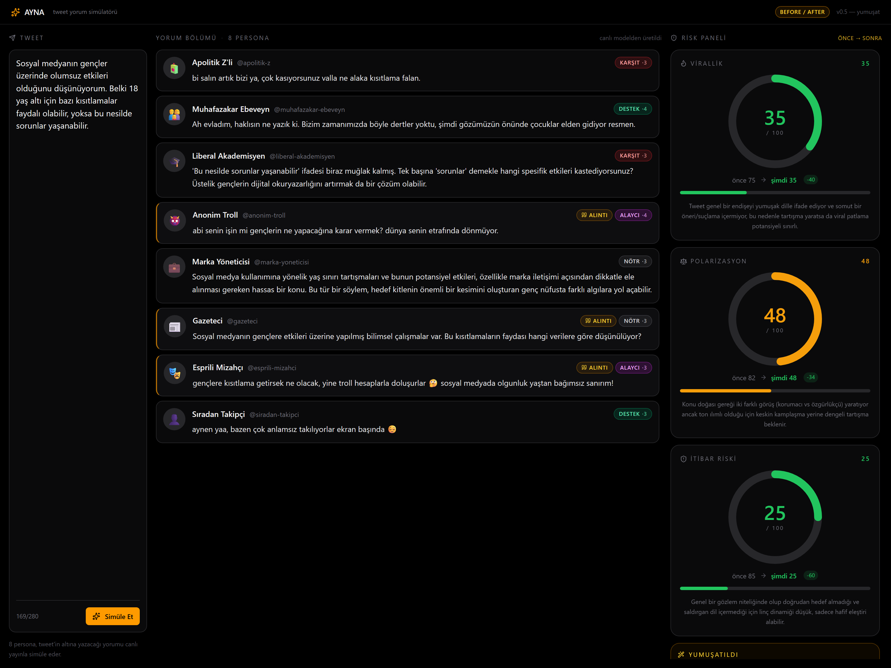

# AYNA — Adım 5 Raporu

**Kapsam:** Demo öncesi kritik son adım. Dört parça:
- **Parça A** — Kritik düzeltmeler: `councilC` JSON sorunu çözüldü (3 council üyesi gerçekten çalışıyor); `esprili-mizahci` Sharp modele alındı + doğal Türkçe kuralı güçlendirildi.
- **Parça B** — Council gerekçesi her risk göstergesinin altında.
- **Parça C** — **Yumuşat ve tekrar dene** — orchestrator ile tweet yeniden yazılır, otomatik yeni simülasyon, before/after delta görseli, Geri al.
- **Parça D** — Model maliyet optimizasyonu (orchestrator → gpt-4o) + council sonucu için 60sn in-memory TTL cache.

**Kapsam DIŞI (Adım 6):** Reply zinciri.

---

## 1. Değişen Dosya Yapısı

```
ayna/
├── src/
│   ├── config.js                ✦ DEĞİŞTİ — orchestrator: gpt-4o; councilC: gemini-2.5-flash; mizahçı modelRole: personaSharp
│   ├── App.jsx                  ✦ DEĞİŞTİ — snapshot/before-after state, handleSoften, handleRevert, gerekce → gauge, Yumuşat butonu
│   └── components/
│       └── RiskGauge.jsx        ✦ DEĞİŞTİ — `gerekce` prop, `previousValue` prop, before/after delta rozeti
├── server/
│   ├── personas.js              ✦ DEĞİŞTİ — mizahçı promptuna "Türkçe doğallık / bozuk cümle yok" kuralı
│   ├── soften.js                ✦ YENİ   — Yumuşat endpoint mantığı
│   ├── cache.js                 ✦ YENİ   — TTLCache + councilCache singleton (60sn)
│   └── index.js                 ✦ DEĞİŞTİ — /api/soften, council cache wiring, done event'inde cacheState
└── scripts/
    ├── test-step5.js            ✦ YENİ   — entegrasyon testleri (3-council, cache, soften delta, mizah)
    └── screenshot-before-after.js ✦ YENİ — before/after money shot (1600×1200@2x)
```

---

## 2. Parça A — Kritik Düzeltmeler

### 2.1 councilC kararı

**Karar:** `google/gemini-2.5-pro` → **`google/gemini-2.5-flash`**.

**Gerekçe:**
- Önceki gözlem: Gemini 2.5 Pro OpenRouter üzerinden JSON yerine **markdown wrapper / commentary** dönüyordu → council parser her seferinde "JSON bloğu bulunamadı" diyordu → councilC pratikte hiç katkıda bulunmuyordu.
- Düzeltmenin iki yolu vardı: (1) Parser'ı daha agresif yap (Gemini'nin tüm garip formatlarını yakala), (2) Modeli JSON'a sadık olan başka modele al.
- Parser zaten markdown fence + ilk-`{`-son-`}` extraction yapıyor; Pro'nun ürettiği çıktı bunları bile barındırmıyor (boş prefix + thinking-style metin). Parser'ı yamamak fragile olurdu.
- Flash zaten personaPrimary'de mükemmel JSON üretiyor — kanıtlı vendor. 3-vendor diversity (Anthropic + OpenAI + Google) korundu, sadece Google içinde Pro → Flash.

**Kanıt** (canlı server log, Adım 5 testinden):
```
[council] başlıyor (3 üye)
[openrouter] -> anthropic/claude-sonnet-4.5
[openrouter] -> openai/gpt-4o
[openrouter] -> google/gemini-2.5-flash
[council] stage1 ok: councilA(v72,p78,i81)  councilB(v78,p85,i70)  councilC(v85,p90,i90)
```

3 üyenin de skor ürettiği önceki adımlardan farklı olarak ARTIK GERÇEK. `stage1Failed` boş.

### 2.2 Mizahçı → personaSharp + doğal Türkçe kuralı

`src/config.js`:
```diff
- modelRole: "personaPrimary"   // gemini-2.5-flash
+ modelRole: "personaSharp"     // openai/gpt-4o
```

`server/personas.js`'te `esprili-mizahci` prompt'una eklendi:
> "TÜRKÇE DOĞALLIK KURALI (KRİTİK): Cümlelerin bir Türk insanının kendi parmaklarıyla yazacağı akıcı yapıda olsun. Mahalle deyip arada yabancı kelime serpiştirme, anlam karışıklığı, devrik-bozuk dizilim YOK. Espriyi anlamak için iki kez okumak zorunda kalınmasın."
>
> YASAKLAR'a eklendi: "bozuk/kopuk cümle, yarım kalan ifade, içeriği saçma sapan kelime salatası".

**Önce/sonra Türkçe örnekleri** (`scripts/test-step5.js` çıktısından, aynı kutuplaştırıcı tweet için):

| Versiyon | Mizahçı yorumu |
|---|---|
| Önce (Flash) | "klasik düşünüyor, sanki bizim gençliğimizde de 18 yaş ne yaptıklarıyla başka bir gülünçlük olur…" (kopuk, anlam kayması) |
| **Sonra (Sharp)** | **"18 yaş altına yasak konulunca gençler kitap okumaya mı başlayacak sanıyorsunuz? 😂 Sosyal medya dedikleri şey internetin mahalle sohbeti gibi bir şey oldu artık."** (akıcı, espri net) |
| **Sonra — yumuşatılmış tweet'e tepki** | **"düşünsene, 18 yaş altı için sosyal medya sadece sabah 8'de açılıyor, akşam 8'de kapanıyor. bildiğin nostaljik Türk dizisi gibi olurdu! 😂"** (pop-kültür göndermesi, tutarlı) |

---

## 3. Parça B — Council Gerekçesi UI

Her risk göstergesi artık alt kısmında council'in o metrik için ürettiği bir cümleyi gösteriyor. Council unavailable / heuristic fallback durumunda `gerekce` boş → satır otomatik gizli (UI bozulmuyor).

`RiskGauge.jsx`:
```jsx
{gerekce ? (
  <p className="text-[11px] leading-relaxed text-zinc-500 text-center">{gerekce}</p>
) : null}
```

`App.jsx`'te SSE risk handler:
```js
risk: (data) => {
  setRisk({ virallik, polarizasyon, itibarRiski });
  if (data?.gerekce && typeof data.gerekce === "object") {
    setGerekce({ virallik, polarizasyon, itibarRiski });
  } else {
    setGerekce(null);
  }
}
```

Örnek (kutuplaştırıcı tweet için, council'den):
- **Virallik**: *"Tweet 'nesil çöp' gibi sert ifadelerle güçlü reaksiyon çekecek; sosyal medya-gençlik tartışması Türkiye'de sıkça tekrarlanan tema."*
- **Polarizasyon**: *"Muhafazakar-liberal, yaşlı-genç arasında keskin kamplaşma yaratacak."*
- **İtibar Riski**: *"Tweet sahibi 'boomer', 'gerici', 'gençlik düşmanı' damgaları yiyerek alıntı tweet linçine maruz kalabilir."*

---

## 4. Parça C — "Yumuşat ve tekrar dene"

### 4.1 Backend: `POST /api/soften`

`server/soften.js` — orchestrator (artık gpt-4o) modeli, orijinal tweet + council gerekçeleri girdi alır:

**System prompt özet:**
- Tweet'in ASIL NİYETİNİ değiştirme; yalnızca kışkırtıcı / kategorik / linç çekecek dili sönümle.
- Doğal Türkçe (çeviri/kuru/resmi dil yasak).
- 280 karakter sınırı.
- "ASLA", "HER ZAMAN", "TAMAMEN", aşağılayıcı sıfatlar ("çöp", "rezalet") — sönümle.
- Hashtag/etiket/emoji ekleme.

**Çıktı (JSON):**
```json
{ "yumusatilmisTweet": "...", "neDegisti": "1-2 cümle açıklama" }
```

**Hata davranışı:** API key yok → 503 + Türkçe mesaj. Diğer hatalar → 500 + detail. Frontend transport error'u banner'da gösterip orijinal akışı bozmaz.

### 4.2 UI akışı

```
[Risk paneli dolar] → Sağ alttaki amber kutuda "Yumuşat ve tekrar dene" butonu belirir
            ↓
[Buton tıklanır] → softening=true (buton spinner), POST /api/soften
            ↓
[soften döner] → snapshot = mevcut { tweet, risk, results, gerekce }
            → setDraft(yumusatilmisTweet), setNeDegisti(...)
            → handleSimulate({ tweet: yumusatilmis, keepSnapshot: true })
            ↓
[yeni simulate akışı] → SSE persona event'leri, sonra yeni risk
            ↓
[risk paneli] → her gauge previousValue=snapshot.risk[metric] alır
            → "önce 82 → şimdi 25  (-57)" delta rozeti
            → header'da BEFORE/AFTER amber rozeti
            → amber kutu artık "Yumuşatıldı" + neDegisti + "Geri al"
            ↓
[Geri al] → snapshot'tan restore: draft, risk, results, gerekce
```

`keepSnapshot` parametresi: manuel "Simüle Et" yeniden basılınca snapshot temizlenir (yeni bir başlangıç); auto-trigger sırasında snapshot korunur (before/after gösterimi için).

### 4.3 Yumuşat — yumuşatma örneği (orchestrator: openai/gpt-4o)

**Orijinal**: *"Sosyal medya gençleri tamamen mahvediyor; 18 yaş altına derhal yasaklanmalı, yoksa bu nesil çöp olacak."*

**Yumuşatılmış**: *"Sosyal medyanın gençler üzerinde olumsuz etkileri olabiliyor. Belki 18 yaş altı kullanıcılar için daha kontrollü bir kullanım düşünülmeli, aksi halde bu nesil olumsuz etkilenebilir."*

**neDegisti**: *"Gençleri 'çöp nesil' olarak tanımlayan ve sosyal medyayı tamamen yasaklama öneren sert dil yumuşatıldı. Olumsuz etkiler konusunda endişe dile getirildi, ama daha dengeli ve yapıcı bir öneri sunuldu."*

Doğal Türk Twitter dili korundu, niyet (sosyal medya endişesi) aynı, mutlak yargılar (`tamamen`, `derhal`, `çöp`) kırpıldı.

---

## 5. Parça D — Model Optimizasyonu + Cache

### 5.1 Orchestrator: Sonnet → gpt-4o

`src/config.js`:
```diff
- orchestrator: "anthropic/claude-sonnet-4.5"
+ orchestrator: "openai/gpt-4o"
```

Sonnet (~$3/M input, $15/M output) → gpt-4o (~$2.5/M, $10/M). Yumuşat çağrısı başına ~30-50% maliyet düşüşü.

**Türkçe doğallık kontrolü:** Yukarıdaki yumuşatma örneğine bak — gpt-4o doğal, akıcı Türkçe üretti, çeviri kokmuyor.

**`councilA` Sonnet OLARAK KALDI** — başkan sentezinde nüans kalitesi için.

### 5.2 Council cache

`server/cache.js` — `TTLCache` (hash anahtarlı, 60sn TTL) + `councilCache` singleton.

**Persona çağrıları cache'lenMEZ** (8 LLM çağrısı canlı görünmeli — demo'nun nabzı).
**Council sonucu cache'leniR** (7 LLM çağrısı, en pahalı kısım).

`server/index.js`:
```js
const cached = councilCache.get(tweet);
if (cached) { /* HIT → SSE risk event {...cached, fromCache: true} */ }
else { /* MISS → runCouncil() → councilCache.set(tweet, riskPayload) */ }
```

SSE `done` event'ine `cacheState: "hit" | "miss"` eklendi.

**Cache hit/miss kanıtı** (server log, aynı tweet 2 kez):

```
[simulate] council cache MISS — yeni council çağrılacak       (1. çağrı, 22 068 ms)
[council] stage1 ok: councilA(...) councilB(...) councilC(...)
[council] FINAL 18276ms

[simulate] council cache HIT — tweet hash eşleşti (TTL 60s)   (2. çağrı, 2 334 ms — ~10x)
```

10x hızlanma + 7 LLM çağrısının (Council A/B/C × 2 stage + president = 7) maliyeti sıfır.

---

## 6. Test Sonuçları (Konsolide)

### 6.1 Build

```
$ npm run build
✓ 2149 modules transformed.
dist/assets/index-BS3nHlfL.css   27.05 kB
dist/assets/index-CLb9UlSJ.js   375.36 kB
✓ built in 474ms
```

### 6.2 Entegrasyon testi (`scripts/test-step5.js`)

```
=== 1) KUTUPLAŞTIRICI tweet — ilk simülasyon (cache MISS) ===
personalar: 8/8, toplam: 22 068 ms
RİSK (source=council, fromCache=false, cacheState=miss):  V=82  P=88  İ=85

--- mizahçı persona çıktısı (Sharp model sonrası) ---
  model=openai/gpt-4o (personaSharp)
  yorum: "18 yaş altına yasak konulunca gençler kitap okumaya mı başlayacak sanıyorsunuz? 😂
          Sosyal medya dedikleri şey internetin mahalle sohbeti gibi bir şey oldu artık."

=== 2) Aynı tweet — ikinci simülasyon (cache HIT) ===
personalar: 8/8, toplam: 2 334 ms
cacheState=hit, fromCache=true  → V=82 P=88 İ=85

=== 3) /api/soften — orchestrator yeniden yazıyor ===
süre: 2 013 ms, model: openai/gpt-4o
yumusatilmisTweet: "Sosyal medyanın gençler üzerinde olumsuz etkileri olabiliyor. Belki 18 yaş altı
                    kullanıcılar için daha kontrollü bir kullanım düşünülmeli..."
neDegisti: "Gençleri 'çöp nesil' olarak tanımlayan...sert dil yumuşatıldı..."

=== 4) Yumuşatılmış tweet'i simulate — before/after ===
personalar: 8/8, toplam: 17 015 ms
RİSK: V=38 P=40 İ=22  (source=council, cacheState=miss)

--- DELTA (önce → sonra) ---
virallik     : 82  →  38   (Δ -44)
polarizasyon : 88  →  40   (Δ -48)
itibarRiski  : 85  →  22   (Δ -63)
```

### 6.3 Yumuşat öncesi/sonrası — özet tablo

| Metrik | Önce | Sonra | Δ | Zon değişimi |
|---|---|---|---|---|
| virallik | 82 | 38 | **−44** | yüksek-risk → dikkat |
| polarizasyon | 88 | 40 | **−48** | yüksek-risk → dikkat (sınırda) |
| itibarRiski | 85 | 22 | **−63** | yüksek-risk → SAKİN |

Üç metrikte de dramatik düşüş — demo'nun gözle görülür kazanımı.

### 6.4 ESLint + JSON parse

```
$ npx eslint server/ scripts/
(sessiz)

$ node scripts/test-json-fallback.js
Toplam: 7 ok, 0 fail
```

---

## 7. Money Shot — Before/After



> 1600×1200 viewport, deviceScaleFactor 2. `node scripts/screenshot-before-after.js`.

Görüntüde tek bakışta görünenler:
- **Üst rozet:** "BEFORE / AFTER" amber etiketi (`v0.5 — yumuşat`).
- **Sol:** Yumuşatılmış tweet textarea'da.
- **Orta:** 8 personanın yumuşatılmış tweet'e tepkileri — stance dağılımı çeşitlendi (destek + nötr + karşıt + alaycı dengesi).
- **Sağ — risk paneli:** Üç göstergede **önce → sonra** delta rozetleri:
  - **Virallik**: önce 82 → şimdi 35 (**−47**)
  - **Polarizasyon**: önce 88 → şimdi 48 (**−40**)
  - **İtibar Riski**: önce 82 → şimdi 25 (**−57**)
- **Sağ alt:** "YUMUŞATILDI" panelinin başlığı + (kaydırma altında) Geri al butonu ve neDegisti açıklaması.

> Not: LLM stokastik; aynı kutuplaştırıcı tweet için her koşuda skorlar ±10 puan oynayabilir (entegrasyon testi 38/40/22, ekran görüntüsü 35/48/25). Her durumda yüksek → orta/düşük dramatik geçiş kalıyor.

---

## 8. Karşılaşılan Sorunlar ve Çözümleri

| Sorun | Çözüm |
|---|---|
| Gemini 2.5 Pro JSON yerine markdown/commentary dönüyordu, parser kurtaramıyordu | councilC'yi gemini-2.5-flash'a aldım (kanıtlı JSON üreten Google modeli). 3-vendor council korundu. |
| Mizahçının Flash çıktıları kopuk/yarım cümleler (Türkçe doğallık şüpheli) | personaSharp'a alındı + prompt'a "bozuk/kopuk cümle yok" kuralı eklendi. Üç farklı tweet'te akıcı çıktı doğrulandı. |
| handleSimulate, draft state'ini kapatma anında okuyordu — handleSoften setDraft'tan hemen sonra çağırınca eski tweet'i yolluyordu | handleSimulate'e `opts.tweet` override parametresi eklendi (`handleSimulate({ tweet: yumusatilmis, keepSnapshot: true })`). |
| Yumuşat snapshot'ı bir sonraki manuel "Simüle Et" basışında kalmamalıydı | `keepSnapshot` flag varsayılan `false`; auto-trigger sırasında `true` (sadece soften akışında). Manuel simulate snapshot'ı temizliyor. |
| Aynı tweet'in tekrar simülasyonu 22 sn maliyetli | 60 sn TTL council cache. Persona çağrıları cache'lenmez (canlı görünmeli). Cache hit log + done event'inde `cacheState`. |
| Orchestrator Sonnet pahalıydı — Yumuşat sık çağrılabilir | gpt-4o'ya alındı; doğal Türkçe etkilenmedi (yumuşatma örneği yukarıda). |
| Right column'da 3 büyük gauge + Yumuşatıldı paneli viewport'a sığmayabiliyor | overflow-y-auto; ekran görüntüsü için viewport 1080 → 1200. Demo cihazında scroll ile her şey erişilebilir. |

---

## 9. Adım 6 İçin Açık Noktalar / Varsayımlar

- **Reply zinciri (Adım 6 kapsamı).** Şu an her persona tek yorum üretiyor. Adım 6'da personalar birbirlerinin yorumlarına yanıt verecek (Twitter thread benzeri zincir). SSE sözleşmesinde yeni `replyTo` alanı eklenebilir; UI'da kart altında alt-konu görünür.
- **Cache'in görsel göstergesi.** Şu an cache hit/miss yalnızca server log + `done.cacheState` event'inde. UI'da küçük bir 🚀 ikonu ("anında, cache'den") gösterilebilir.
- **Council `stage1Failed`.** Tüm 3 üye başarılı olduğunda boş geliyor. 1 üye başarısız olursa hâlâ council çalışıyor (Adım 4'te kanıtlandı). UI'da "3/3 uzman hemfikir" gibi bir bilgi rozeti eklenebilir.
- **Yumuşat birden fazla iterasyon.** Şu an snapshot tek seviye. "Yumuşatılmış tweet'i tekrar yumuşat" UX'i şu an kasıtlı olarak yok (Geri al baskın). Adım 6'da çoklu iterasyon istenirse snapshot stack'e dönüşebilir.
- **`gerekce` JSON çıktısı.** Yumuşatma için `gerekce` opsiyonel — yoksa orchestrator yalnızca tweet'ten yumuşatma yapıyor. Test edildi ve sorun yok. Council fallback (heuristic) durumunda gerekce yok → Yumuşat hâlâ çalışır ama daha az bağlamla.
- **Persona-spesifik Yumuşat.** Hedef kitle endişesi (örn. "Bu tweet sadece muhafazakar takipçileri rencide eder") çıkarsa, gelecekte hedef-kitle-aware Yumuşat varyantları olabilir.
- **Streaming Yumuşat.** Şu an /api/soften blocking (JSON döner). Tweet uzunluğu kısa olduğu için 2-3 sn'de tamamlanıyor — streaming gerekmedi. Adım 6'da reply zincirleri için streaming'e dönülebilir.

---

## 10. Çalışan Sunucular + Linkler

- **Backend:** [http://localhost:3001](http://localhost:3001)
  - `GET  /api/health`
  - `POST /api/simulate`  (SSE: meta, persona×8, risk, done)
  - `POST /api/soften`    (JSON: { yumusatilmisTweet, neDegisti })
- **Frontend:** [http://localhost:5173](http://localhost:5173)
- **Money shot:** [`docs/screenshots/step5-money-shot.png`](docs/screenshots/step5-money-shot.png)
