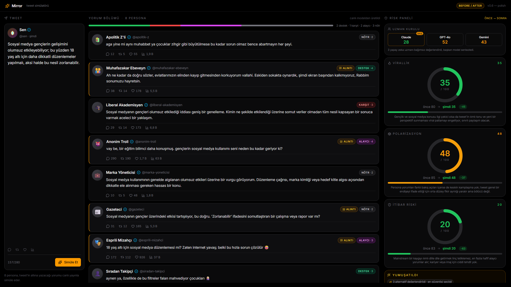

# Mirror — Font / Renk / Kutu Cilası

Sadece görsel cila. Backend, council, persona, ToT, demo cache mantığı dokunulmadı.

## Değişen dosyalar

| Dosya | Değişiklik |
|---|---|
| `index.html` | Google Fonts **Inter** (400/500/600/700) preconnect + stylesheet eklendi |
| `src/index.css` | `--font-sans` başına `"Inter"`; body `letter-spacing: -0.011em` + `font-feature-settings: "cv11","ss01"`; `--color-surface` `#15181c → #16181c` (X tweet zemini); diğer color tokenları zaten X tonlarındaydı |
| `src/components/PersonaCard.jsx` | Card hover: `transition-[background-color,border-color] 150ms ease-out` + `hover:bg-zinc-900/65 hover:border-zinc-700/80` (X-tarzı hafif zemin değişimi) |
| `src/App.jsx` | (önceki turda) Header `AYNA → Mirror`, `tweet yorum simülatörü → tweet simülatörü` |

## Korunanlar

- **Layout (12-col, 2/7/3 grid)** — değişmedi.
- **Amber accent + risk eşik renkleri (yeşil/amber/kırmızı)** — Mirror'ın kendi kimliği olarak duruyor.
- **X kuş/Twitter logosu YOK** — sadece lucide `BadgeCheck` (önceki turdan).
- **Tüm animasyonlar, ToT akışı, Council mantığı, demo cache** — değişmedi.

## Test

```
$ npm run build
dist/index.html                   0.84 kB
dist/assets/index-Bb91zDWW.css   34.44 kB
dist/assets/index-DH9j7KdC.js   384.05 kB
✓ built in 476ms
```

- `AYNA_DEMO_MODE=1` server ayakta (`http://localhost:3001/api/health` → 200, model OK).
- Vite dev (`http://localhost:5173`) HMR'la yenilendi, font Google Fonts'tan yükleniyor.
- 1080p screenshot scroll'suz: 
- `prefers-reduced-motion` davranışı dokunulmadı; CSS media query global olarak duruyor.

## 1080p doğrulama


Görünenler (scroll YOK):
- Header: "Mirror · tweet simülatörü" (Inter 600 + 11px gri)
- Sol: X-stili composer (Sen / @sen / 🪞 avatar / tik / rakamsız etkileşim)
- Orta: 8 persona kartı — Inter ile X tweet hissi belirginleşti, hover'da hafif zemin tonu
- Sağ: Uzman Kurulu paneli + 3 risk gauge + Yumuşatıldı / Geri al

## Push

```
git add . && git commit -m "AYNA - X-stili font, renk ve kart yapisi" && git push
```

Push sonucu raporun en altında.
