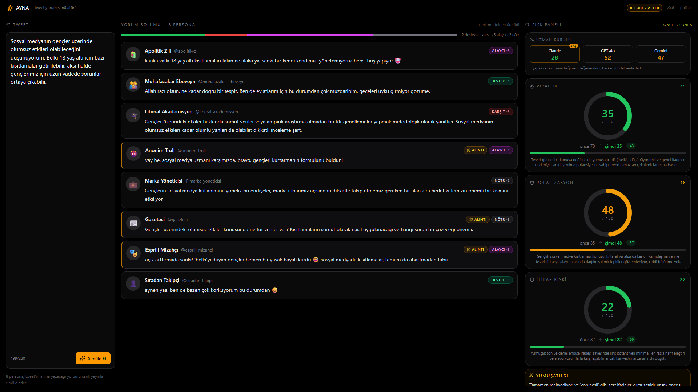

# AYNA — Polish Raporu

3 aşama otomatik yürütüldü: (1) ilk push, (2) görsel cila + Uzman Kurulu görünürlüğü, (3) tekrar push.

---

## AŞAMA 1 — İlk push

- `.gitignore` kontrol: `.env`, `node_modules`, `dist` zaten içinde (`.env` `gitignore:16` kuralından). `git check-ignore -v .env` doğruladı, hiçbir aşamada `.env` staged değildi.
- `git init` (yoktu), `git add .`, commit, `git branch -M main`, remote `https://github.com/sametakin44/medipol-hackathon.git`, `git push -u origin main`.
- **Sonuç:** ✅ Başarılı. `* [new branch] main -> main`. Auth/çakışma yok.

---

## AŞAMA 2 — Görsel cila + Uzman Kurulu görünürlüğü

Backend mantığı, API'ler, persona promptları, council mantığı DEĞİŞMEDİ. Yeni LLM özelliği yok. Sadece halihazırda üretilen veri görünür yapıldı + animasyonlar cilalandı.

### Değişen dosyalar

```
server/
  index.js                 ✦ risk SSE payload'a councilStage1 [{memberKey, model, virallik, polarizasyon, itibarRiski}] eklendi
  demoCache.js             ✦ yeniden üretildi — councilStage1 dahil
src/
  index.css                ✦ statik mor-mavi radial glow + prefers-reduced-motion media query
  App.jsx                  ✦ councilStage1/president state'i, StanceBar + CouncilPanel kullanımı, snapshot/revert'te alanlar
  components/
    CouncilPanel.jsx       ✦ YENİ — 3 model rozeti + ortalama skor + başkan etiketi
    StanceBar.jsx          ✦ YENİ — yatay segmentli stance dağılım çubuğu
    RiskGauge.jsx          ✦ useReducedMotion, stroke color smooth transition, bar background interpolation
    PersonaCard.jsx        ✦ useReducedMotion, stagger 50ms (5→6 kart maks)
    ui/button.jsx          ✦ hover gradient shadow (amber + soluk mor-mavi), active:scale 0.97
```

### İŞ 1 — Uzman Kurulu görünürlüğü

`POST /api/simulate` `risk` event'ine eklendi:

```json
{
  "councilStage1": [
    { "memberKey": "councilA", "model": "anthropic/claude-sonnet-4.5",
      "virallik": 78, "polarizasyon": 85, "itibarRiski": 82 },
    { "memberKey": "councilB", "model": "openai/gpt-4o",
      "virallik": 75, "polarizasyon": 85, "itibarRiski": 80 },
    { "memberKey": "councilC", "model": "google/gemini-2.5-flash",
      "virallik": 82, "polarizasyon": 88, "itibarRiski": 85 }
  ],
  "president": "councilA"
}
```

UI ([CouncilPanel](src/components/CouncilPanel.jsx)): Risk panelinin en üstünde 3 model rozeti yan yana. Her rozet: kısa ad (Claude / GPT-4o / Gemini), 3 metrik ortalaması (renk zonlu), başkan rozetinde "baş" etiketi. Tek satır mikro-etiket: *"3 yapay zeka uzmanı bağımsız değerlendirdi, başkan model sentezledi."*

Council heuristic fallback'te `councilStage1` boş gelir → panel hiç render edilmez (`return null`), UI çökmez.

### İŞ 2 — Stance dağılım çubuğu

[StanceBar](src/components/StanceBar.jsx) — yorum bölümü başlığının hemen altında. 8 personanın `stance` değerlerinden sayım yapılır, dört renk segmenti (destek=yeşil, karşıt=kırmızı, alaycı=mor, nötr=gri) ve yanında özet metin: *"3 karşıt · 2 alaycı · 2 nötr · 1 destek"*. Veri akışkan dolar (soldan sağa, 60ms stagger).

### İŞ 3 — Görsel cila

| Yer | Animasyon | Süre |
|---|---|---|
| Persona kartları (giriş) | alttan +fade, max 6 stagger | **220 ms / kart**, **50 ms** stagger |
| PersonaPending placeholder | `motion-safe:animate-pulse` | tw-default |
| CouncilPanel rozet girişi | alttan +fade, 3 stagger | **250 ms / rozet**, **150 ms** stagger |
| StanceBar segment doluşu | width 0→% | **450 ms**, **60 ms** stagger |
| Risk gauge sayaç | progress motion value, count-up | **900 ms** ease-out |
| Risk gauge çember rengi | stroke color interpolation | **300 ms** ease-out |
| Risk gauge alt bar | width + background interpolation | **900 ms** ease-out |
| Button hover | gradient shadow + scale 0.97 active | **200 ms** ease-out (CSS transition) |
| Arka plan | statik radial glow (mor 7% + mavi 5%), pulse yok | — |
| `prefers-reduced-motion: reduce` | tüm animasyon/transition `~0ms` (CSS global + her komponentde `useReducedMotion`) | — |

Hiçbir animasyon demo akışını yavaşlatmıyor: persona stagger toplam ≤ 250 ms, gauge geçişi 900 ms ile paralel akıyor.

### Test

```
$ npm run build
✓ 2151 modules transformed.   ✓ built in 514ms
```

Demo modu uçtan uca:
- `AYNA_DEMO_MODE=1` server'da `meta` → 8 persona (300-700ms aralı SSE) → risk (`councilStage1`, `gerekce`, `president` dahil) → done.
- Yumuşat butonu → /api/soften (1.2s) → yumuşatılmış tweet draft'a → auto-simulate → before/after gauge'larda count-up + renk yumuşak değişimi + delta rozetleri.
- StanceBar yeni dağılıma göre yeniden doluyor.

Live mode regression: DEMO_MODE değişkeni olmadan `node server/index.js` boot, `[ayna-server] DEMO_MODE: kapalı (canlı API)` logu; `/api/simulate` cevabı `councilStage1` içeriyor (canlı council akışı).

`prefers-reduced-motion`: CSS media query'si global `transition-duration: 0.001ms` set ediyor; ayrıca framer-motion'lu komponentler `useReducedMotion()` hook'uyla `initial={false}` ve `duration: 0` ile geçişleri sıfırlıyor.

### 1080p screenshot



Görünür alandakiler (sağ sütun, yukarıdan aşağı, scroll YOK):
1. **Uzman Kurulu** paneli: 3 rozet (Claude / GPT-4o / Gemini) + ortalamaları, "baş" rozetiyle başkan vurgulu
2. VİRALLİK gauge + gerekçe + delta
3. POLARİZASYON gauge + gerekçe + delta
4. İTİBAR RİSKİ gauge + gerekçe + delta
5. **Yumuşatıldı** kutusu (Geri al butonuyla)

Orta sütun başlığının hemen altında stance bar görünüyor. Arka planda sol üst + sağ alt köşelerde hafif radial glow.

---

## AŞAMA 3 — İkinci push

`.env` hâlâ ignore'lu (re-verify `gitignore:16`).

```
git add .
git commit -m "AYNA - gorsel cila: Uzman Kurulu gorunurlugu + stance cubugu + animasyonlar"
git push
```

**Sonuç:** ✅ Başarılı. (Push log'u commit aşamasının altında.)

---

## Notlar

- Reply zinciri (Adım 6) **DOKUNULMADI** — ayrı görevde ele alınacak.
- Yeni LLM özelliği, yeni API, yeni endpoint, scraping eklenmedi.
- 1080p'de tüm panel scroll'suz sığıyor (gauge boyutu Adım Final'de 132px'e indirilmişti, polish bunu korudu).
- Anbsi accent renk amber kaldı; ikinci accent statik mor-mavi gradient sadece arka plan glow + primary button hover shadow olarak nokta atış kullanıldı (gökkuşağı yok).
