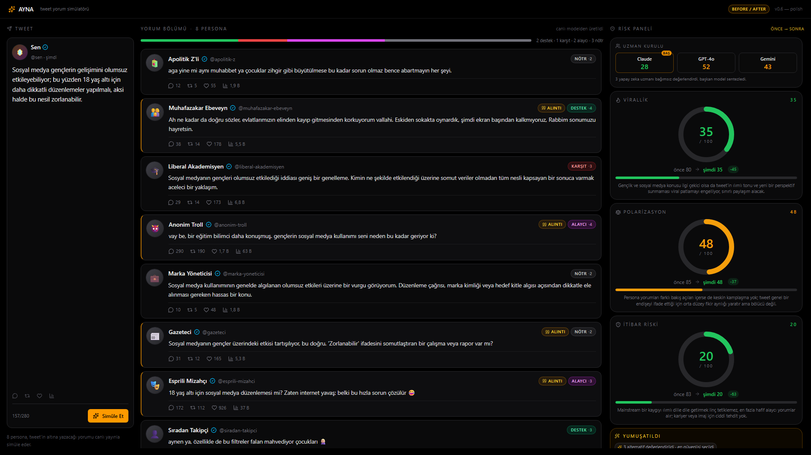

# AYNA — Son Özellik: ToT + X-stili Görsel

Üç iş bitti: (1) X (Twitter) görsel estetiği, (2) ölçülü dinamik figürler, (3) Yumuşat'a Tree-of-Thoughts.

---

## 1. Değişen dosyalar

```
src/
  config.js                    ✦ + softenEvaluator: google/gemini-2.5-flash
  App.jsx                      ✦ X-stili composer, softenTot state, ToT etiketi
  lib/engagement.js            ✦ YENİ — persona payload'tan deterministik X etkileşim sayıları
  components/
    PersonaCard.jsx            ✦ X-stili kart: yuvarlak avatar, BadgeCheck, engagement row, count-up
                                 typing dots dalga
server/
  soften.js                    ✦ Tree-of-Thoughts: 3 paralel dal + değerlendirici, en iyi dal seçimi
  demoCache.js                 ✦ yeniden üretildi — branches + secilenDal + evaluatorModel
docs/screenshots/
  step-tot-1080p.png           ✦ YENİ — 1080p X-stili + ToT money shot
```

Backend mantığı değişmedi (council/persona promptları aynen), sadece `/api/soften` ToT şemasıyla yeniden yazıldı.

---

## 2. X (Twitter) görsel estetiği

**Persona kartı** ([PersonaCard.jsx](src/components/PersonaCard.jsx)):
- Yuvarlak avatar (40px) — emoji `from-zinc-700 to-zinc-800` gradient çember, `ring-1` ince halka.
- İsim + (lucide) `BadgeCheck` sky-400 doğrulama tiki + `@persona-id`.
- `replyType="quote"` kartlarda iç sol kenarda amber bar + amber "alıntı" rozeti — X alıntı-tweet hissi.
- Alt: ince border-top + 4 ikon satırı (`MessageCircle` / `Repeat2` / `Heart` / `BarChart3`) + sayılar.
- **Sahte ama tutarlı sayılar** — `src/lib/engagement.js`: persona reach katsayısı (troll/mizahçı/gazeteci yüksek; sıradan takipçi/marka düşük) × intensity^1.8 × stance boost × willEngage × deterministik hash jitter. Aynı persona her zaman aynı tabanı verir.
- Sayı formatı Türkçe: `formatTrCount` — `2843 → "2,8 B"`, `124000 → "124 B"`, `1500000 → "1,5 Mn"`.

**Composer (sol sütun)**:
- Üstte yuvarlak amber-fuchsia gradient avatar + 🪞 + "**Sen**" + sky tik + "@sen · şimdi".
- Ortada düzenlenebilir textarea (140px min).
- Altta rakamsız 4 X ikonu (yorum/RT/beğeni/görüntülenme).
- Char counter + Simüle Et / Durdur eski yerinde.

**Telif uyarısı uygulandı:** Gerçek X/Twitter kuş logosu YOK. Yalnızca lucide-react'in jenerik `BadgeCheck` ikonu kullanıldı.

---

## 3. Ölçülü dinamik figürler

| Yer | Animasyon | Süre |
|---|---|---|
| `PersonaPending` typing dots | 3 nokta yumuşak dalga (y: 0→-3→0, stagger 150ms) | 900ms loop |
| Engagement metrics (kart belirince) | `useMotionValue` count-up 0→değer, ease-out | **300ms** |
| Risk gauge sayaç | (mevcut) progress motion value | 900ms |
| Button hover | amber shadow + soluk mor-mavi accent + active scale 0.97 | 200ms (CSS) |
| Persona kartı (giriş) | (mevcut) alttan +fade, stagger 50ms × max 6 | 220ms |

Hepsi `useReducedMotion()` ile reduced-motion altında 0ms'ye düşüyor; CSS'te ayrıca global `transition-duration: 0.001ms !important` `prefers-reduced-motion: reduce` media query.

Sürekli dönen/zıplayan dekoratif öge YOK.

---

## 4. Yumuşat — Tree-of-Thoughts

[`server/soften.js`](server/soften.js):

```
   tweet + gerekce
        │
        ├──── orchestrator (gpt-4o) — DAL 1: "olculu"            ┐
        ├──── orchestrator (gpt-4o) — DAL 2: "soruya-cevir"      │ PARALEL (Promise.all)
        └──── orchestrator (gpt-4o) — DAL 3: "kisiselden-genele" ┘
                          │
                          ▼
             softenEvaluator (gemini-2.5-flash — UCUZ)
             her dala  riskDusus + niyetKorunma  (0-100)
             en yüksek toplam + niyet öncelikli  → secilen
                          │
                          ▼
       { yumusatilmisTweet, neDegisti, secilenDal, branches[], ... }
```

**Strateji tanımları** (server/soften.js içinde):
- `olculu` — sertlik/mutlaklık kırp, aşağılayıcı sıfat çıkar.
- `soruya-cevir` — iddiaları soru formuna çevir ("X olmalı" → "X olmalı mı?").
- `kisiselden-genele` — kişisel/grupsal hedeflemeyi genel gözleme çevir.

**Değerlendirici** prompt'u: orijinal + 3 alternatif → her biri için riskDusus ve niyetKorunma. En iyi alternatifi seçer + 1 cümle gerekçe.

**Performans:** 3 dal + 1 değerlendirici çağrısı, hepsi PARALEL (Promise.all) → toplam ≈ tek dal süresi + evaluator. Demo log:
```
[soften:tot] -> olculu (openai/gpt-4o)
[soften:tot] -> soruya-cevir (openai/gpt-4o)
[soften:tot] -> kisiselden-genele (openai/gpt-4o)
[soften:tot] <- soruya-cevir 2241ms
[soften:tot] <- olculu 2553ms
[soften:tot] <- kisiselden-genele 4118ms
[soften:tot] -> evaluator (google/gemini-2.5-flash)
[soften:tot] <- evaluator 1190ms — seçilen=olculu
```
Toplam ≈ 5.3s canlı modda (önceki tek-shot ≈ 2s; ToT trade-off iş başına ~3s).

**Demo mode:** demoCache.js'te tüm 3 branch + skorlar + seçim cached → `/api/soften` **ANINDA döner** (1.2s sleep ile gerçekçi UX). Video çekiminde bekleme yok.

**UI:** Yumuşat sonrası amber kutuda küçük rozet:
> ✨ 3 alternatif değerlendirildi · en güvenlisi seçildi

Hover'da `title` attribütünde 3 dalın label + skor özetleri görünür (yer israfı yok).

**Council DEĞİŞMEDİ:** councilA başkanı hâlâ `anthropic/claude-sonnet-4.5`. `softenEvaluator` ayrı yeni rol.

---

## 5. Test sonuçları

### Build
```
$ npm run build
✓ 2154 modules transformed.
dist/assets/index-Dg-WpGNo.css   34.04 kB │ gzip:  6.87 kB
dist/assets/index-Ch4EWF6F.js   383.98 kB │ gzip: 122.82 kB
✓ built in 504ms
```

### Canlı mod (ToT regression)
`scripts/generate-demo-cache.js` (gerçek API'yi vuran üretici) çalıştı, 3 dal + evaluator log'ları görüldü, demoCache yazıldı. ToT şeması alanlarını içeriyor:
```
"branches": [...3 obje...]
"secilenDal": "olculu"
"evaluatorModel": "google/gemini-2.5-flash"
```

### Demo mode
`AYNA_DEMO_MODE=1` ile server up → Playwright'in 1080p akışı (tweet yaz → Simüle Et → Yumuşat → before/after) **anında** akıyor, ToT çağrısı 1.2s'lik makul gecikmeyle bitiyor.

### Reduced-motion
`@media (prefers-reduced-motion: reduce)` CSS + her komponentte `useReducedMotion()` — typing dots y=0 sabit, count-up 0ms (anında set), kart giriş `initial={false}`.

### 1080p
Screenshot: 

Görünür alandakiler (scroll YOK):
- Sol: X-stili composer (avatar + Sen + tik + textarea + rakamsız etkileşim ikonları).
- Orta: 8 X-stili persona kartı, her birinin altında etkileşim sayıları (örn. apolitik-z `2,7 B 💬 / 168 🔁 / 124 ❤️ / 124 B 📊`).
- Sağ: Uzman Kurulu paneli (3 model rozeti) + 3 risk gauge'ı + Yumuşatıldı kutusu içinde "3 alternatif değerlendirildi · en güvenlisi seçildi" etiketi + Geri al.

---

## 6. Push

```
$ git add .
$ git commit -m "AYNA - X-stili kartlar + dinamik figurler + Yumusat ToT"
$ git push
```

Push sonucu en aşağıda (push komutundan sonra).
